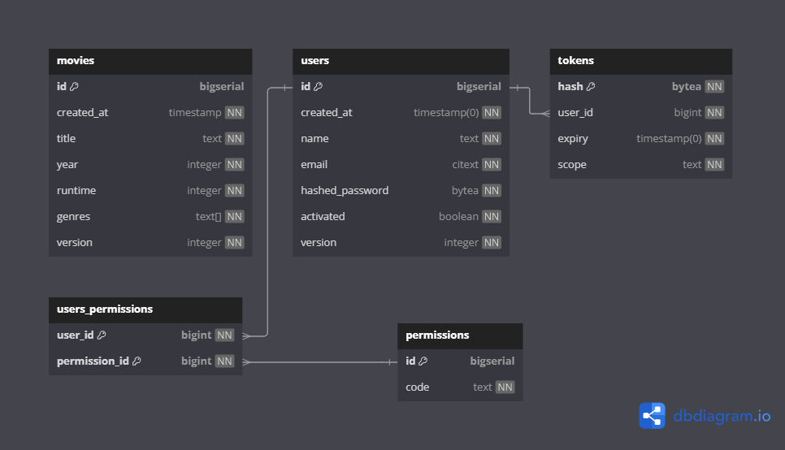

    

# Greenlight

Greenlight is a **Go application** offers a **reliable, fast, and secure** API for performing **CRUD operations** on movies, featuring
**authentication** and **permission-based authorization**.
It includes advanced functionalities such as **filtering, sorting, and pagination** for movie lists, concurrency control
using **Context**, comprehensive **logging and error handling**, **IP-based rate limiting**,
**graceful application shutdown**, **background email sending**, **metrics collection**, and support for building,
versioning, and quality control.

## Diagrams

## Prerequisites

- [Go programming language](https://go.dev/doc/install)
- [Ubuntu WSL2](https://ubuntu.com/desktop/wsl)
- PostgresDB running on port `:5432` by default.
- [Mailtrap](https://mailtrap.io/) API token

# Installation

    $ git clone https://github.com/minhnghia2k3/green-light.git

## Usage

- Creating `greenlight` database

      postgres=# CREATE DATABASE greenlight
      postgres=# \c greenlight

- Creating `citext` extension

      greenlight=# CREATE EXTENSION citext;

- Copying `.env.example` to `.env` (modify fields if needed)

      $ cp .env.example .env

- Running application

      $ make run

## License

[Alex Edwards's Lets Go Further](https://lets-go-further.alexedwards.net/)

[MIT](https://choosealicense.com/licenses/mit/)

